# 🔄 Guia de Migração: Evolution API → UAZAPI

> **Status:** ✅ CONCLUÍDO
> **Data:** 2025-01-18

---

## 📋 Resumo da Migração

Esta migração atualiza completamente o código para usar a **UAZAPI** ao invés da Evolution API, incluindo:

- ✅ Biblioteca `lib/uazapi-client.js` reescrita com autenticação correta
- ✅ API Route `/api/whatsapp/instance/manage` atualizada
- ✅ Novos métodos de autenticação (admintoken + token)
- ✅ Fluxo de QR Code corrigido
- ✅ Suporte a Pairing Code

---

## 1️⃣ VARIÁVEIS DE AMBIENTE

### Atualizar `.env.local`

```bash
# ============================================================================
# UAZAPI (WhatsApp Integration)
# ============================================================================

# Base URL da UAZAPI
UAZAPI_BASE_URL=https://swiftbot.uazapi.com

# Admin Token (para endpoints administrativos)
UAZAPI_ADMIN_TOKEN=YCXL1ENXtPvVQgB7NVsMskSX7oxYUMHRtXlOvh8mdBdyX1WFZ3

# Webhook URL (onde a UAZAPI enviará eventos)
UAZAPI_WEBHOOK_URL=https://seu-dominio.com/api/webhooks/uazapi

# ============================================================================
# Supabase (Banco de Dados)
# ============================================================================
NEXT_PUBLIC_SUPABASE_URL=https://xxx.supabase.co
NEXT_PUBLIC_SUPABASE_ANON_KEY=xxx
SUPABASE_SERVICE_ROLE_KEY=xxx

# ============================================================================
# REMOVER (Variáveis antigas da Evolution API)
# ============================================================================
# EVOLUTION_API_URL=...  ❌ REMOVER
# EVOLUTION_API_KEY=...  ❌ REMOVER
# N8N_WEBHOOK_URL=...    ❌ REMOVER (substituído por UAZAPI_WEBHOOK_URL)
```

### Variáveis Obrigatórias

| Variável | Descrição | Exemplo |
|----------|-----------|---------|
| `UAZAPI_BASE_URL` | Base URL da API | `https://swiftbot.uazapi.com` |
| `UAZAPI_ADMIN_TOKEN` | Token administrativo global | `YCXL1ENXtPvVQgB7NVsMs...` |
| `UAZAPI_WEBHOOK_URL` | URL do webhook | `https://seu-dominio.com/api/webhooks/uazapi` |

### Variáveis Opcionais

| Variável | Descrição | Padrão |
|----------|-----------|--------|
| `UAZAPI_WEBHOOK_URL` | Webhook para eventos | `null` (webhook não configurado) |

---

## 2️⃣ AUTENTICAÇÃO NA UAZAPI

### Diferenças Críticas

A UAZAPI usa **dois tipos de autenticação** diferentes:

#### **A) Admin Token (`admintoken` header)**

Usado para endpoints **administrativos**:

- `POST /instance/init` - Criar instância
- `POST /instance/updateAdminFields` - Atualizar campos admin
- `POST /globalwebhook` - Configurar webhook global

```javascript
headers: {
  'admintoken': process.env.UAZAPI_ADMIN_TOKEN
}
```

#### **B) Instance Token (`token` header)**

Usado para endpoints **específicos da instância**:

- `GET /instance/status` - Ver status (QR Code, Pairing Code)
- `POST /instance/connect` - Iniciar conexão
- `POST /instance/disconnect` - Desconectar

```javascript
headers: {
  'token': instanceToken // Token retornado em /instance/init
}
```

### Exemplo de Uso

```javascript
import { uazapi } from '@/lib/uazapi-client'

// 1. Criar instância (usa admintoken)
const instanceData = await uazapi.createInstance('swiftbot_user123', 'client_id', 'metadata')
const instanceToken = instanceData.token // Salvar!

// 2. Conectar (usa token da instância)
await uazapi.connectInstance(instanceToken)

// 3. Obter QR Code (usa token da instância)
const statusData = await uazapi.getInstanceStatus(instanceToken)
const qrCode = uazapi.extractQRCode(statusData)

// 4. Desconectar (usa token da instância)
await uazapi.disconnectInstance(instanceToken)
```

---

## 3️⃣ ENDPOINTS E MÉTODOS

### Mapeamento Evolution API → UAZAPI

| Operação | Evolution API (Antigo) ❌ | UAZAPI (Novo) ✅ | Auth |
|----------|---------------------------|------------------|------|
| Criar instância | `POST /instance/create` | `POST /instance/init` | admintoken |
| Conectar | `GET /instance/connect/:name` | `POST /instance/connect` | token |
| Ver status | `GET /instance/connectionState/:name` | `GET /instance/status` | token |
| Desconectar | `DELETE /instance/logout/:name` | `POST /instance/disconnect` | token |
| Atualizar campos admin | `PUT /instance/updateAdminFields/:name` | `POST /instance/updateAdminFields` | admintoken |
| Webhook global | `POST /globalwebhook` | `POST /globalwebhook` | admintoken |

### Biblioteca `uazapi-client.js`

#### Métodos Disponíveis

```javascript
// 1. Criar instância
await uazapi.createInstance(name, adminField01, adminField02)
// Retorna: { id, name, token, adminField01, adminField02, status }

// 2. Obter status (QR Code, Pairing Code)
await uazapi.getInstanceStatus(instanceToken)
// Retorna: { status, qrcode, paircode, phoneNumber }

// 3. Conectar instância
await uazapi.connectInstance(instanceToken, phoneNumber = null)
// phoneNumber: null = QR Code mode, "5511999999999" = Pairing Code mode

// 4. Desconectar
await uazapi.disconnectInstance(instanceToken)

// 5. Atualizar campos administrativos
await uazapi.updateAdminFields(instanceId, adminField01, adminField02)
// ATENÇÃO: Usa instanceId (UUID), não o token!

// 6. Configurar webhook global
await uazapi.configureGlobalWebhook(webhookUrl, events, excludeMessages)

// 7. Helpers
uazapi.generateInstanceName(userId) // Gera nome único
uazapi.extractQRCode(statusData) // Extrai QR Code
uazapi.extractPairingCode(statusData) // Extrai Pairing Code
uazapi.isConnected(statusData) // Verifica se está conectado
uazapi.isConnecting(statusData) // Verifica se está conectando
```

---

## 4️⃣ FLUXO DE INTEGRAÇÃO

### Fluxo Completo (POST → GET polling → Connected)

```mermaid
sequenceDiagram
    participant F as Frontend
    participant API as Next.js API
    participant UAZAPI as UAZAPI
    participant DB as Supabase

    F->>API: POST /api/whatsapp/instance/manage
    API->>DB: Validar assinatura
    API->>UAZAPI: POST /instance/init (admintoken)
    UAZAPI-->>API: { id, token, ... }
    API->>DB: Salvar instanceToken
    API->>UAZAPI: POST /instance/connect (token)
    API->>UAZAPI: GET /instance/status (token)
    UAZAPI-->>API: { qrcode, status: "connecting" }
    API-->>F: { qrCode, instanceToken }

    F->>F: Exibir QR Code

    loop Polling (a cada 3 segundos)
        F->>API: GET /api/whatsapp/instance/manage?userId=xxx
        API->>UAZAPI: GET /instance/status (token)
        UAZAPI-->>API: { status: "connecting", qrcode }
        API-->>F: { connecting: true, qrCode }
    end

    Note over UAZAPI: Usuário escaneia QR Code

    F->>API: GET /api/whatsapp/instance/manage?userId=xxx
    API->>UAZAPI: GET /instance/status (token)
    UAZAPI-->>API: { status: "connected", phoneNumber }
    API->>DB: Atualizar status -> connected
    API-->>F: { connected: true, phoneNumber }
    F->>F: Exibir "Conectado!"
```



### Exemplo Frontend (React)

```javascript
'use client'

import { useState, useEffect } from 'react'

export default function ConnectWhatsAppButton({ userId }) {
  const [loading, setLoading] = useState(false)
  const [qrCode, setQrCode] = useState(null)
  const [connected, setConnected] = useState(false)
  const [error, setError] = useState(null)
  const [instanceToken, setInstanceToken] = useState(null)

  // POST: Criar e conectar instância
  const handleConnect = async () => {
    setLoading(true)
    setError(null)

    try {
      const response = await fetch('/api/whatsapp/instance/manage', {
        method: 'POST',
        headers: { 'Content-Type': 'application/json' },
        body: JSON.stringify({
          userId,
          adminFields: {
            adminField01: 'client_abc',
            adminField02: 'web_dashboard'
          }
        })
      })

      const data = await response.json()

      if (!data.success) {
        throw new Error(data.error)
      }

      // Salvar token para polling
      setInstanceToken(data.data.instanceToken)
      setQrCode(data.data.qrCode)

      // Iniciar polling
      startPolling()

    } catch (err) {
      setError(err.message)
    } finally {
      setLoading(false)
    }
  }

  // GET: Polling para verificar status
  const startPolling = () => {
    const interval = setInterval(async () => {
      try {
        const response = await fetch(`/api/whatsapp/instance/manage?userId=${userId}`)
        const data = await response.json()

        if (data.connected) {
          clearInterval(interval)
          setConnected(true)
          setQrCode(null)
        } else if (data.qrCode) {
          setQrCode(data.qrCode) // Atualizar QR Code se mudou
        }
      } catch (err) {
        console.error('Erro no polling:', err)
      }
    }, 3000) // A cada 3 segundos

    // Parar após 2 minutos
    setTimeout(() => clearInterval(interval), 120000)
  }

  // DELETE: Desconectar
  const handleDisconnect = async () => {
    // Implementar se necessário
  }

  return (
    <div>
      {!connected ? (
        <>
          <button onClick={handleConnect} disabled={loading}>
            {loading ? 'Conectando...' : '📱 Conectar WhatsApp'}
          </button>

          {error && <p className="text-red-500">{error}</p>}

          {qrCode && (
            <div>
              <h3>Escaneie o QR Code:</h3>
              
              <p>Atualizando... (aguardando conexão)</p>
            </div>
          )}
        </>
      ) : (
        <div>
          <h3>✅ WhatsApp Conectado!</h3>
          <button onClick={handleDisconnect}>Desconectar</button>
        </div>
      )}
    </div>
  )
}
```

---

## 5️⃣ SCHEMA DO BANCO (Supabase)

### Revisão da Tabela `whatsapp_connections`

O schema existente (`database/schema-whatsapp.sql`) **JÁ ESTÁ ADEQUADO** para a UAZAPI!

#### Campos Principais

| Campo | Tipo | Descrição | Mapeamento UAZAPI |
|-------|------|-----------|-------------------|
| `id` | UUID | ID interno do Supabase | - |
| `user_id` | UUID | ID do usuário | - |
| `instance_name` | VARCHAR | Nome da instância | `name` do `/instance/init` |
| `instance_token` | TEXT | Token da instância | `token` do `/instance/init` ✅ |
| `waba_id` | VARCHAR | ID da instância UAZAPI | `id` do `/instance/init` ✅ |
| `phone_number_id` | VARCHAR | Número conectado | `phoneNumber` do `/instance/status` |
| `status` | VARCHAR | Status da conexão | `status` do `/instance/status` |
| `admin_field_01` | VARCHAR | Campo administrativo 1 | `adminField01` |
| `admin_field_02` | VARCHAR | Campo administrativo 2 | `adminField02` |

#### ✅ Schema Está Correto!

**Não é necessário alterar o schema.** Os campos já suportam os dados retornados pela UAZAPI:

- `instance_token` → Armazena o `token` retornado
- `waba_id` → Armazena o `id` retornado
- `status` → Armazena o `status` (`connecting`, `connected`, `disconnected`)
- `admin_field_01` e `admin_field_02` → Armazenam campos customizados

---

## 6️⃣ FLUXO LÓGICO DA API ROUTE

### POST `/api/whatsapp/instance/manage`

**Ação:** Criar nova instância e iniciar conexão

**Request Body:**
```json
{
  "userId": "uuid-do-usuario",
  "connectionId": "uuid-opcional",
  "adminFields": {
    "adminField01": "client_id",
    "adminField02": "metadata"
  }
}
```

**Fluxo:**
1. Validar assinatura do usuário
2. Verificar limite de conexões do plano
3. **Criar instância** → `POST /instance/init` (admintoken)
4. Salvar `instanceId` e `instanceToken` no Supabase
5. **Iniciar conexão** → `POST /instance/connect` (token)
6. **Obter QR Code** → `GET /instance/status` (token)
7. Configurar webhook global (se `UAZAPI_WEBHOOK_URL` configurado)
8. Retornar `qrCode`, `pairCode`, `instanceToken`

**Response:**
```json
{
  "success": true,
  "data": {
    "connectionId": "uuid-supabase",
    "instanceId": "uuid-uazapi",
    "instanceName": "swiftbot_user123",
    "instanceToken": "token-da-instancia",
    "qrCode": "data:image/png;base64,...",
    "pairCode": null,
    "status": "connecting",
    "message": "QR Code gerado com sucesso. Escaneie com seu WhatsApp."
  }
}
```

---

### GET `/api/whatsapp/instance/manage`

**Ação:** Verificar status e obter QR Code/Pairing Code

**Query Params:**
- `userId=uuid` **OU**
- `connectionId=uuid`

**Fluxo:**
1. Buscar conexão no Supabase
2. **Obter status** → `GET /instance/status` (token)
3. Extrair `qrCode`, `pairCode`, `phoneNumber`
4. Se status mudou para `connected`, atualizar Supabase
5. Retornar status atualizado

**Response:**
```json
{
  "success": true,
  "connected": false,
  "connecting": true,
  "status": "connecting",
  "qrCode": "data:image/png;base64,...",
  "pairCode": "ABC123",
  "data": {
    "instanceName": "swiftbot_user123",
    "phoneNumber": null,
    "lastConnected": null
  }
}
```

---

### DELETE `/api/whatsapp/instance/manage`

**Ação:** Desconectar instância

**Query Params:**
- `connectionId=uuid`

**Fluxo:**
1. Buscar conexão no Supabase
2. **Desconectar** → `POST /instance/disconnect` (token)
3. Atualizar status no Supabase → `disconnected`
4. Retornar sucesso

**Response:**
```json
{
  "success": true,
  "message": "Instância desconectada com sucesso"
}
```

---

## 7️⃣ DIFERENÇAS PRINCIPAIS

### Evolution API (Antigo) ❌

- Usava `apikey` header para tudo
- Endpoints RESTful com nome da instância na URL
- QR Code vinha direto no `/instance/connect`
- Webhook configurado por instância

### UAZAPI (Novo) ✅

- Usa **dois tipos** de autenticação (`admintoken` + `token`)
- Endpoints usam headers, não URL params
- **QR Code vem do `/instance/status`**, não do `/connect`!
- Webhook global configurado uma vez
- Suporta **Pairing Code** além de QR Code

---

## 8️⃣ CONFIGURAR WEBHOOK GLOBAL

### Uma Vez na Produção

```bash
# Via cURL
curl -X POST "https://swiftbot.uazapi.com/globalwebhook" \
  -H "Content-Type: application/json" \
  -H "admintoken: YCXL1ENXtPvVQgB7NVsMskSX7oxYUMHRtXlOvh8mdBdyX1WFZ3" \
  -d '{
    "url": "https://seu-dominio.com/api/webhooks/uazapi",
    "events": ["messages", "connection"],
    "excludeMessages": ["wasSentByApi"]
  }'
```

### Via Código (Automático)

O webhook é configurado automaticamente na primeira chamada de `POST /api/whatsapp/instance/manage` se a variável `UAZAPI_WEBHOOK_URL` estiver definida.

---

## 9️⃣ CHECKLIST DE MIGRAÇÃO

- [x] Atualizar `lib/uazapi-client.js`
- [x] Atualizar `/api/whatsapp/instance/manage/route.js`
- [ ] Adicionar variáveis de ambiente no `.env.local`
- [ ] Remover variáveis antigas (`EVOLUTION_API_URL`, `EVOLUTION_API_KEY`)
- [ ] Testar fluxo de criação de instância
- [ ] Testar exibição de QR Code
- [ ] Testar polling de status
- [ ] Testar conexão completa
- [ ] Testar desconexão
- [ ] Configurar webhook global em produção
- [ ] Atualizar documentação

---

## 🔟 PRÓXIMOS PASSOS

1. **Atualizar `.env.local`** com as novas variáveis
2. **Reiniciar servidor** Next.js: `npm run dev`
3. **Testar fluxo completo** no navegador
4. **Configurar webhook** em produção (quando fizer deploy)
5. **Atualizar webhook handler** (`/api/webhooks/evolution`) para `/api/webhooks/uazapi` (se necessário)

---

## 📞 Suporte

Se encontrar problemas:

1. Verifique logs do console (cliente e servidor)
2. Confirme que variáveis de ambiente estão corretas
3. Teste endpoints manualmente com cURL
4. Revise a documentação da UAZAPI fornecida

---

**✅ Migração Concluída com Sucesso!** 🎉
